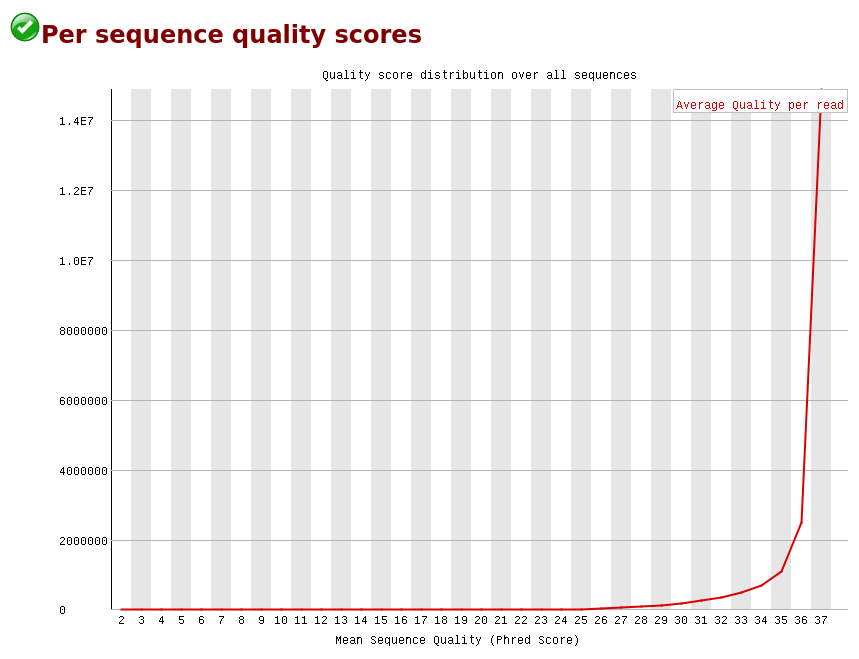
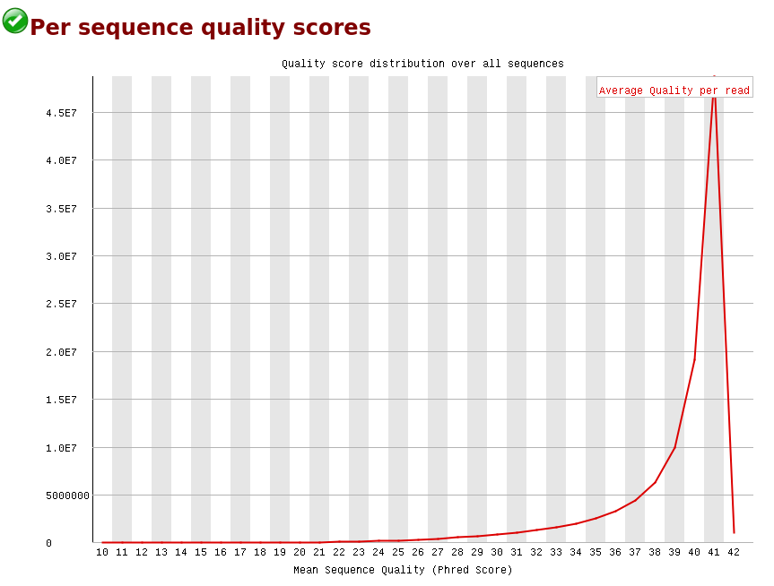
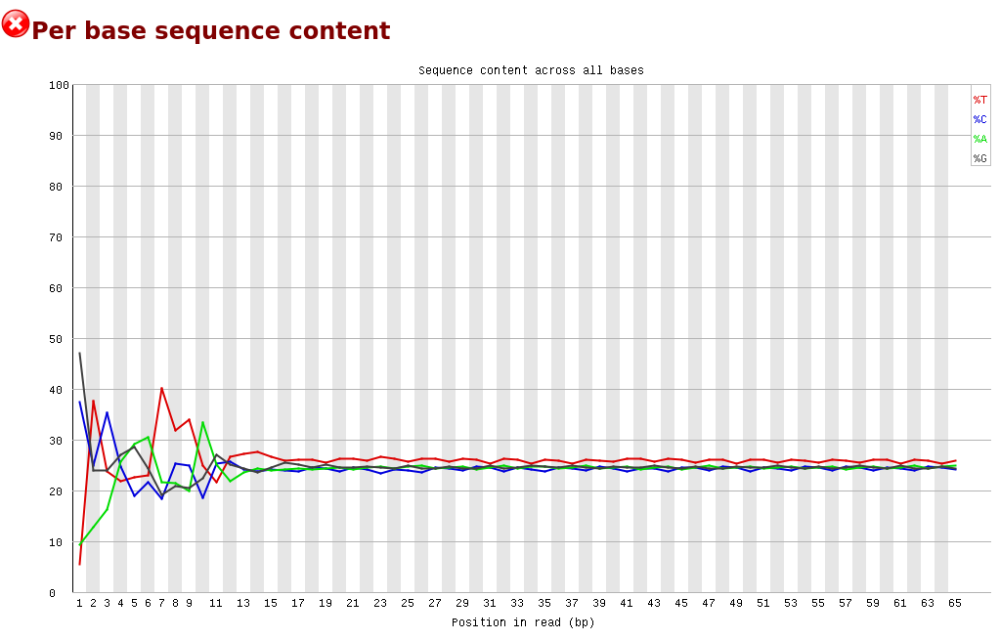
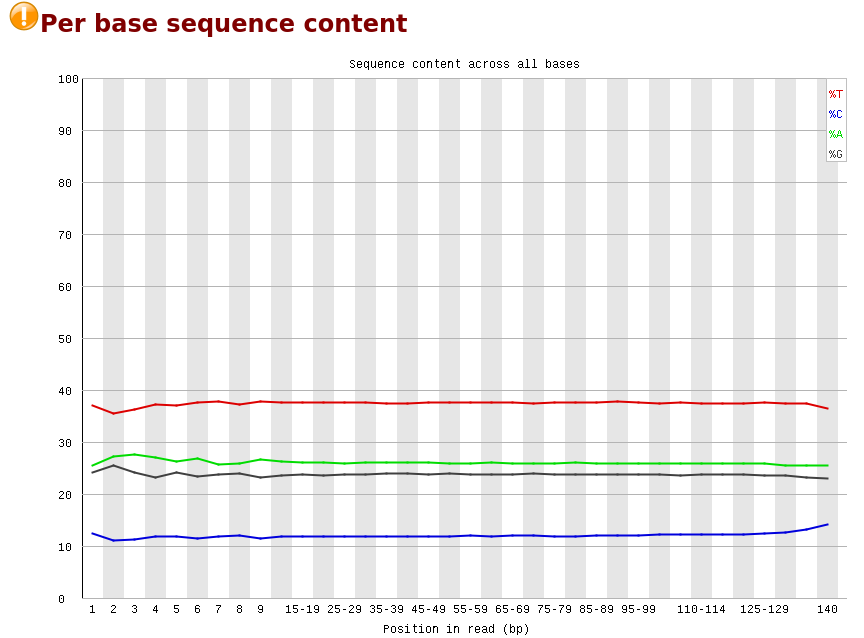
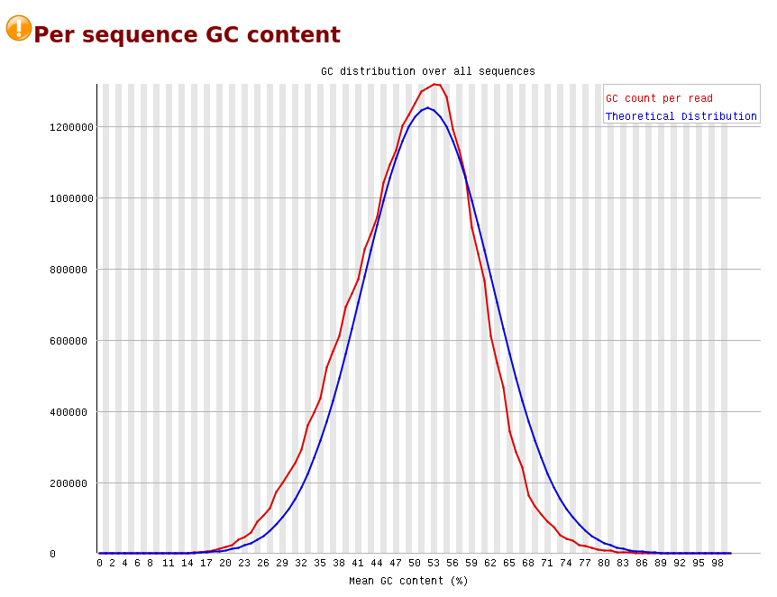
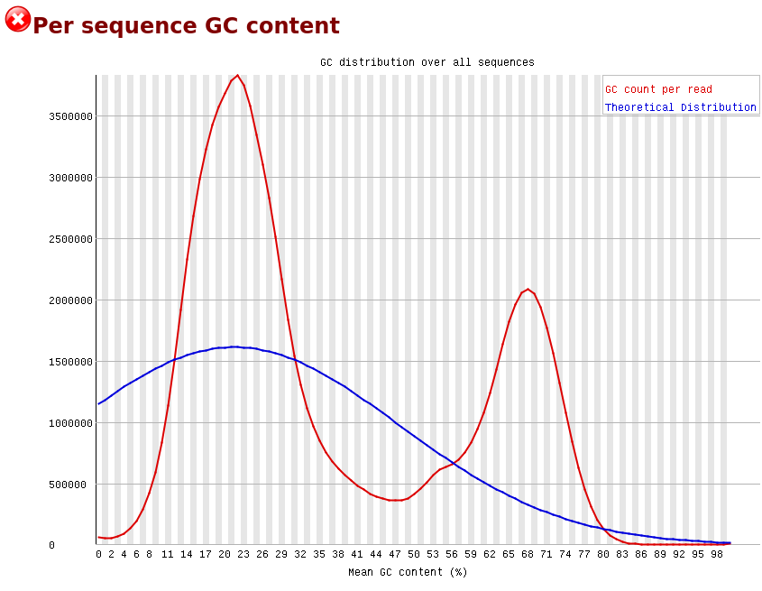
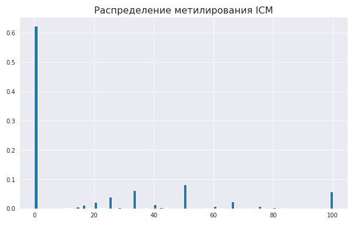
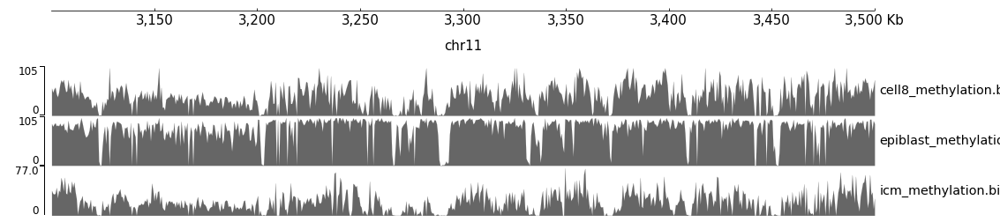
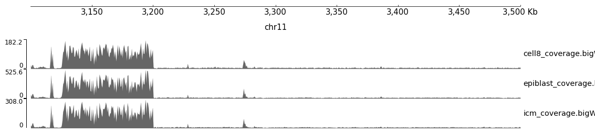

# hse_hw1_meth

ссылка на код:
https://colab.research.google.com/drive/1Px9Wnbs_KXFkYNOsOJByMyGU65n50-xz?usp=sharing

## 1. Анализ QC прочтений
Отчет находится в директории html_report.
Наблюдается значительное преобладание GC нуклеотидов в сравнении с остальными (per sequence GC content). 
Стоит учесть тот факт, что для данного отчета был выбран образец с увеличением уровня метилирования(согласно предположению), а значит, можем сделать вывод о том, что наблюдаемая картина подтверждает сделанные ранее предположения. 

По первому и второму изображению видно, что к концу секвенирования метилирования - падает quality score

У метилирования на протяжении всего секвенирования % нуклеотида одинаковый, но по количеству разный, а в RNA - стабилизуруется и становится одинаковый у всех нуклеотидов

У метилирования график очень сильно отличается от теоритического, а у RNA - нет

## 2. 
### 1) Количество ридов, закартированных на конкретные участки для каждого образца:  
| Образец   |11347700-11367700|40185800-40195800|
|:---------:|:---------------:|:---------------:|
| cell8     | 1090            | 464             |
| epiblast  | 2328            | 1062            |
| ICM       | 1456            | 630             |

### 2) Дедупликация файлов  
|Образец |Кол-во дупликаций|Процент Дупликаций|
|:------:|:---------------:|:----------------:|
|cell8   |521904           |18.31%            |
|epiblast|205258           |2.92%             |
|ICM     |377882           |9.08%             |

### 3) Коллинг метелирование
Done

### 4) Отчет
Отчеты также находятся в директории html_report. 
В полученных отчетах графики демонстрируют долю метелирования на всех позициях хромосомы. Также можно отметить, что больше всего метилирования происходит в образце Epiblast, значительно меньше в 8Cell, и еще меньше в ICM.

  
### 5) Гистограмы распределения метелирования цитозинов по хромосоме

Вывод: для образца Epiblast наблюдается наибольший уровень метилирования ДНК (метилируется большая часть хромосомы). В образце ICM метилирования практически не происходит, а в 8Cell - менее значительно, чем в Epiblast. Следовательно, можно сделать вывод о том, что на разных этапах развития эмбриона уровень метилирования ДНК изменяется.

### 6) Визуализация уровня метелирования и покрытия
Митилирование:

Покрытие:

